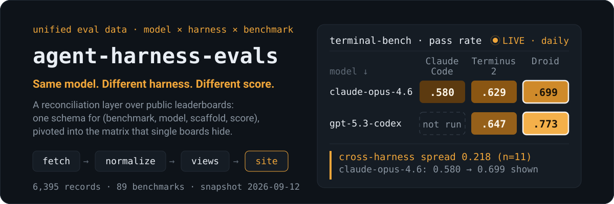

<p align="center">
  <a href="https://alloevil.github.io/agent-harness-evals/">
    
  </a>
</p>

<p align="center">
  <a href="https://alloevil.github.io/agent-harness-evals/"><b>Explore the live matrix →</b></a>
</p>

The same model does not get the same score. On terminal-bench, `claude-opus-4-6` passes **58.0%** of tasks under Claude Code and **69.9%** under Droid; `gpt-5.3-codex` moves from **64.7%** (Terminus 2) to **77.3%** (Droid). Median cross-harness spread across 31 models: **11 points** — the same order of magnitude as a model-generation upgrade. Model leaderboards hide this variable. This project gives it an axis.

## What it is

Not another benchmark. An **aggregation and reconciliation layer** over benchmarks that already exist:

1. **Fetch** live leaderboard data (Epoch AI Benchmarking Hub, 75 benchmarks, refreshed ~daily, CC-BY).
2. **Normalize** model / scaffold / score semantics into one record schema — `(benchmark, model, scaffold, score)`.
3. **Render** views no single leaderboard offers, starting with the **model × harness matrix**: same model as the row, harnesses as columns, per-model `spread` = the share of the score the harness controls.

Existing cross-layer corpora ([Messier](https://arxiv.org/abs/2607.25891), [HAL](https://github.com/princeton-pli/hal-harness)) are one-off snapshots; live leaderboards are single-layer. This repo is the missing combination: **cross-layer and alive** — a scheduled `fetch → normalize → build` run keeps the page exactly as fresh as the upstream data, with zero evaluation cost.

## Use it

```bash
pip install -r requirements.txt
python src/fetch.py && python src/normalize.py && python src/views_harness.py && python src/snapshot.py && python src/build_site.py && python src/build_trend.py
```

Outputs:

| artifact | content |
|---|---|
| `data/clean/records.parquet` | 2,440 unified records across 27 benchmarks |
| `data/snapshots/*.jsonl` | daily snapshots — history is diffable, powers the trend view |
| `views/harness_matrix_*.{csv,md}` | per-benchmark model × harness matrices |
| `docs/index.html` | the [live matrix](https://alloevil.github.io/agent-harness-evals/) — self-contained |
| `docs/trend.html` | [score over time](https://alloevil.github.io/agent-harness-evals/trend.html), one line per harness |

## Record schema

Follows the reconciliation model of [Messier](https://arxiv.org/abs/2607.25891) (model, scaffold, environment, task, verifier), collapsed to benchmark granularity for sources that publish only aggregates.

| field | meaning |
|---|---|
| `benchmark` | canonical benchmark id |
| `model` / `model_raw` | canonical id (release-config suffix stripped) / original |
| `scaffold` | agent harness; `""` = provider-default |
| `score`, `score_unit` | primary metric; `rate` = 0–1 comparable, `raw` = source units |
| `source`, `source_link` | provenance, down to per-run logs where upstream provides them |

## Sources

| source | layer | cadence | status |
|---|---|---|---|
| [Epoch Benchmarking Hub](https://epoch.ai/benchmarks) | models + harnesses (mirrors Terminal-Bench agent×model board) | ~daily | live |
| [Messier corpus](https://arxiv.org/abs/2607.25891) | historical task/verifier-level backfill (960k trials) | snapshot | planned |
| [HAL](https://hal.cs.princeton.edu/) | harness×model×cost across 9 benchmarks (26k rollouts) | snapshot, paused | planned |

## Status & limitations

- **Harness dimension has one live source.** Terminal-Bench is currently the only leaderboard that is continuously updated, machine-readable, and records the harness. SWE-bench pins a single harness (mini-swe-agent), so its official board is a model ranking, not a harness matrix; HAL records harnesses but has paused new submissions and encrypts its traces. When that ecosystem changes, this repo adds the source — it does not invent harness data.
- **Scores are aggregates, not trials.** Upstream publishes benchmark-level scores; `spread` is computed from those, with a per-model `n` and `stderr` where reported. n<3 spreads are dimmed.
- **Tool-layer comparisons** (tool A vs tool B under a fixed agent) have no public data source yet and are out of scope until one exists.

## License

Code MIT. Data CC-BY, credit [Epoch AI](https://epoch.ai/benchmarks).
